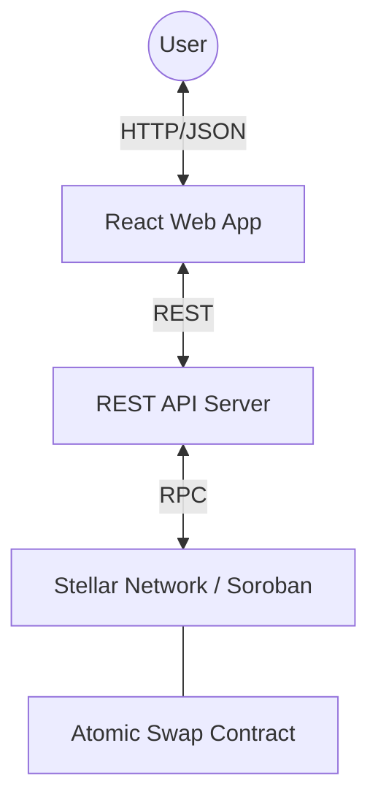
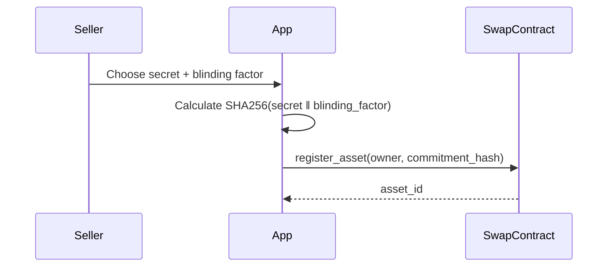
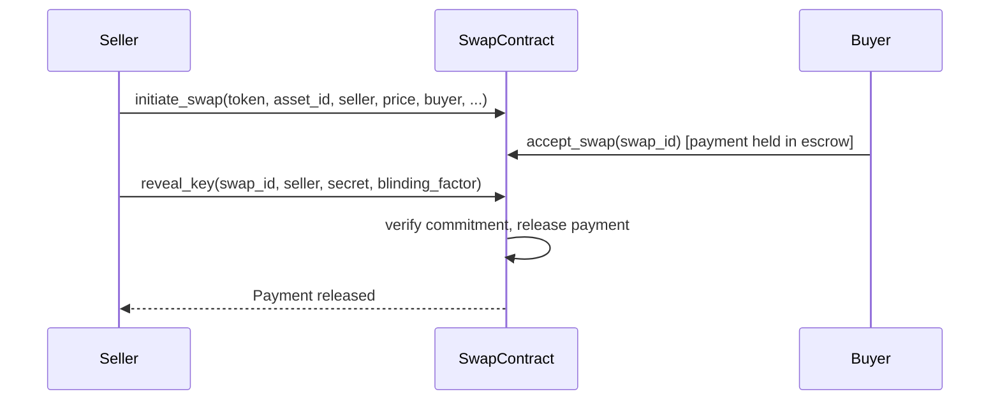

# System Architecture

SwapIT is a trustless atomic swap protocol built on the Stellar network using Soroban smart contracts. A single `atomic_swap` contract owns everything: asset commitments, escrow, disputes, oracles, and settlement.

## 🏗️ High-Level Component Diagram

## 🔒 Security Architecture: Hiding Commitments

Before a swap can be initiated, the seller registers the asset behind a hiding commitment — the same secret/blinding-factor scheme used by hash-locked atomic swaps and HTLCs:

1. **Preimage:** `Secret (32 bytes) ‖ Blinding Factor (32 bytes)`
2. **Commitment:** `SHA256(Preimage)`
3. **Storage:** Only the `commitment_hash`, `owner`, and a `revoked` flag are stored on-chain — the secret and blinding factor never touch a transaction until reveal.

A swap only completes when the seller reveals the `secret`/`blinding_factor` pair and the contract recomputes the hash and checks it against the stored commitment. If the hash doesn't match, the reveal is rejected and the buyer's payment stays in escrow, refundable after expiry.

## 🔄 Core Flows

### 1. Asset Registration Flow

### 2. Atomic Swap Flow

If the seller never reveals, `cancel_expired_swap` lets the buyer recover their funds after the swap's expiry window.

## 💾 Storage Model

### Asset Commitments
- **NextAssetId:** Monotonic counter for unique asset IDs.
- **AssetCommitment (u64):** `{ owner, commitment_hash, revoked }` for each registered asset.
- **CommitmentUsed (BytesN\<32\>):** Reverse mapping to reject duplicate registration of the same commitment hash.

### Swaps
- **Swap (u64):** The full `SwapRecord` — seller, buyer, price, token, status, expiry, and the escrow/dispute/insurance/installment fields relevant to that swap's mode.
- **ActiveSwap (u64):** Maps `asset_id → swap_id` for whichever swap currently holds a lock on that asset (cleared on completion or cancellation).
- **SwapHistory, SwapApprovals, DisputeEvidence, ArbitratorCommittee, PendingRuling, DisputeBond, InsurancePool, Auction, PaymentSchedule, …**: per-feature storage keyed by `swap_id` (or `auction_id`), used by the batch, arbitration, insurance, auction, and installment flows.

See [contracts/atomic_swap/src/lib.rs](../contracts/atomic_swap/src/lib.rs)'s `DataKey` enum for the authoritative list.

## 🗂️ registry.rs — Local Asset-Commitment Module

`contracts/atomic_swap/src/registry.rs` holds the asset-commitment logic described above, in the same contract as the swap logic itself — there is no separate registry contract or cross-contract call involved. It exposes:

| Function | What it does |
|---|---|
| `register_asset(env, owner, commitment_hash)` | Stores a new `AssetCommitment` and returns its `asset_id`. Rejects a commitment hash that's already registered. |
| `revoke_asset(env, owner, asset_id)` | Marks an asset revoked; only its owner may do this. |
| `ensure_seller_owns_active_asset(env, asset_id, seller)` | Panics with `NotAssetOwner` or `AssetRevoked` if the guard fails. Called from `initiate_swap` and its variants. |
| `verify_commitment(env, asset_id, secret, blinding_factor)` | Recomputes the hash and compares it to the stored commitment. Called from `reveal_key` and its batch/multi-signer variants. |

Keeping this in one small module (rather than inlined at every call site) makes the auditable surface for "what can unlock a swap" a single file, even though it's no longer a cross-contract boundary.

## 🌍 Infrastructure

- **Network:** Stellar Testnet & Mainnet.
- **RPC:** Public Soroban RPC nodes (SDF).
- **Automation:** GitHub Actions for contract deployment and API testing.
- **Monitoring:** Periodic health checks and ledger event indexing (planned).
